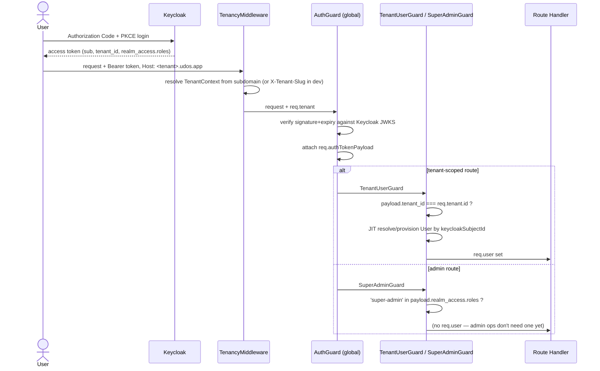

# Phase 10 — Authentication

**Builds on:** [Architecture §6](./phase-2-architecture.md#6-security-architecture) (Keycloak decision, RBAC/ABAC split), [System Design §4](./phase-4-system-design.md#4-sequence-authentication--authorization-every-request-not-just-login) (the auth sequence diagram this phase implements).
**Artifacts:** [`infra/keycloak/setup-realm.mjs`](../infra/keycloak/setup-realm.mjs) (realm as code), `apps/api/src/platform/auth/*`, `apps/api/src/modules/iam/interface/tenant-user.guard.ts`, `apps/api/src/modules/tenant/interface/super-admin.guard.ts`.

---

## 1. What actually runs, end to end

Verified live against a real Keycloak 26.1.0 instance (not mocked): unauthenticated → 401, wrong-role → 403, cross-tenant token → 403, valid Super Admin token → 200/201 on `/admin/tenants`, valid tenant-member token → 200 on `/tenant/me` with the JIT-provisioned `User` row actually present in Postgres afterward.

## 2. The RBAC/Keycloak split (why two different trust models coexist)

Tenant-scoped permissions (`UserRoleAssignment`, Phase 6c) are **not** carried in the token — `GetUserAbilityUseCase` re-reads them from our own database on every request, so revoking a Teacher's role takes effect on their very next request, not at next token refresh. Keycloak's only jobs are proving identity (`sub`), carrying tenant membership (`tenant_id` claim), and — the one exception — the `super-admin` realm role, which **is** trusted straight from the token.

That asymmetry is deliberate, not an inconsistency: Super Admins are a small, rare, high-trust group (software-company staff) where "a revoked admin keeps working until their token expires (≤5 min, `accessTokenLifespan` in the realm config)" is an acceptable tradeoff, in exchange for not needing a database round-trip + a parallel "platform role" system for a handful of people. Ordinary tenant RBAC, covering thousands of students/faculty across many institutions with real per-request revocation requirements, does not get that tradeoff.

## 3. Two real bugs found by testing against a live Keycloak, not by reasoning about it

Both were invisible from reading the Admin REST API responses — they only showed up decoding actual issued tokens.

**Bug 1 — tokens had no `sub` claim at all.** Keycloak attaches a realm's *default* client scopes to every new client automatically — but only if the client's `defaultClientScopes` is left unset. Passing an explicit list at client-creation time (to control exactly which scopes `udos-web` gets) **replaces** the realm defaults instead of extending them, and the built-in `basic` scope — which carries the `sub`/`auth_time` core claims — was not in that explicit list. Result: syntactically valid, signature-valid JWTs with no way to identify the user. Fixed by adding `basic` to every client's scope list, and — since this is exactly the kind of thing that's easy to silently regress — `setup-realm.mjs` now reconciles scopes on *every* run (`ensureClientHasDefaultScope`), not just at creation.

**Bug 2 — the `tenant_id` custom attribute silently vanished.** Keycloak 24+'s declarative User Profile validates every user attribute against a schema and drops anything not declared there — via the Admin REST API, with no error. `create-dev-user.mjs` was setting `attributes: { tenant_id: [...] }` on user creation; the Admin API returned 201 and the attribute was simply never persisted. Fixed by setting the realm's `unmanagedAttributePolicy` to `ENABLED` (`ensureUserProfileAllowsCustomAttributes`), which is the right default for a dev/setup script; a production realm could instead declare `tenant_id` explicitly in the User Profile schema and use a stricter policy.

Both are now permanent, idempotent steps in `setup-realm.mjs` — re-running it (Phase 11's cloud deployment will) reconciles a realm that's missing either fix.

## 4. What's still open

- **`aud`/`azp` audience checking** is not enforced yet — `JwtVerifierService` validates issuer and signature/expiry only. Tightening this (checking the token was actually issued for `udos-web`, not just any client in the realm) is a Phase 14 hardening item, tracked deliberately rather than silently skipped.
- **No user-management UI.** JIT provisioning (`ResolveOrProvisionUserUseCase`) means the *first* successful login for a given Keycloak identity creates the local `User` row — there's no invite flow, no way to pre-assign a role before first login, and a JIT-provisioned user starts with zero `UserRoleAssignment` rows (so they pass authentication but fail every `@RequirePermission` check until a Super Admin — via a future admin-console feature — assigns one). This is honest, working behavior for Phase 10's scope, not a stand-in for something faked.
- **Refresh tokens / session renewal** on the frontend is Phase 10e's concern, not covered by this backend-focused note.

---

**Next:** the frontend Authorization Code + PKCE login flow that actually gets a real browser session into this pipeline (Phase 10e), then Phase 11's cloud deployment, which needs this same realm config reproducible outside a laptop.
