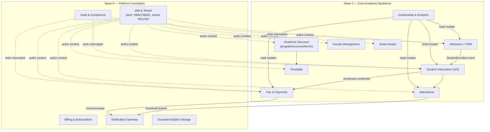
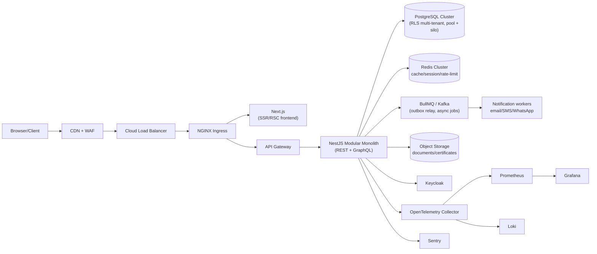

# Phase 2 — Software Architecture Document

**Builds on:** [Phase 1 PRD](./phase-1-prd.md) §4 (tenancy), §5 (roles), §6 (Wave 0–1 scope).
**Scope of this document:** target-state architecture for Wave 0 (Platform) + Wave 1 (Core Academic Backbone). Wave 2–4 modules plug into this same architecture without structural change — that's the point of getting this document right now.

---

## 1. The one decision everything else depends on: Modular Monolith, not day-one Microservices

The brief asks for "every module independently deployable" and "cloud native." The naive reading is 20–30 microservices (one per module) from the start. That's the wrong call for this project, for a specific reason: **premature service boundaries are drawn wrong.** Nobody knows yet whether "Attendance" and "Timetable" should be one service or two until real usage patterns exist — and splitting a monolith along observed seams is a mechanical refactor, while merging two microservices back together after a wrong split is a months-long distributed-transaction cleanup.

**Decision:** Build a **modular monolith** — one NestJS deployable, internally organized as strictly isolated modules (bounded contexts, §2) that talk to each other only through defined application-service interfaces and domain events, never by reaching into each other's database tables. Each module is *structured* as if it were a microservice (own domain layer, own persistence schema/namespace, own public interface) so that extracting any one of them into a real separate deployment later is a boundary-preserving extraction, not a rewrite.

This satisfies "independently deployable" as an *architectural property held in reserve*, not a day-one operational reality — which is what actually matters, because the alternative (real microservices now) means a team that's never run this system in production is simultaneously solving distributed transactions, service discovery, and eventual consistency, on top of getting the domain model right. That combination is how enterprise rewrites die.

**When a module actually gets extracted:** when it has a genuinely different scaling profile from the rest (e.g., Notifications fanning out to millions of messages, or a future OMR/AI inference service needing GPU nodes) — not on a schedule.

## 2. Bounded Contexts (DDD)

Each context below is a NestJS module with its own domain/application/infrastructure layers (§3) and its own set of database tables (logically namespaced, physically in the same Postgres cluster per §5).



Solid arrows = domain events (async, via outbox → Kafka/BullMQ, §4). Dotted arrows = cross-cutting concerns applied to every module (authz, audit), not domain coupling.

## 3. Per-Module Internal Structure (Clean Architecture)

Every module — Wave 0 through Wave 4 — follows the same four layers, so a new engineer who understands one module understands all of them:

```
modules/<module-name>/
  domain/            # Entities, Value Objects, domain events, domain services — zero framework imports
  application/        # Use cases (command/query handlers), ports (interfaces the domain needs)
  infrastructure/      # Prisma repositories implementing ports, external gateway adapters (payment, SMS)
  interface/           # REST controllers, GraphQL resolvers, DTOs, validation — the only layer that knows HTTP
```

**Dependency rule:** `interface` → `application` → `domain` ← `infrastructure`. Domain never imports from the other three. This is what makes the domain layer unit-testable without a database and portable if a module is later extracted.

**SOLID in practice here, concretely:**
- **S:** a use case class does one command (`EnrollStudentUseCase`, not a `StudentService` god-class with 40 methods)
- **O:** payment providers, notification channels, storage backends are ports (interfaces) with swappable adapters — adding Stripe later doesn't touch `application`
- **L:** any `PaymentProvider` adapter (Razorpay today, Stripe tomorrow) must satisfy the same contract including error semantics, or it isn't a valid substitution
- **I:** ports are narrow (`FeeInvoicePort`, not a giant `FinancePort`) so consumers don't depend on methods they don't use
- **D:** `application` depends on the `PaymentProvider` interface it defines, not on the Razorpay SDK directly; `infrastructure` provides the implementation and is wired via NestJS DI at the composition root

## 4. Communication Patterns

| Pattern | Used for | Mechanism |
|---|---|---|
| Synchronous, intra-process | Module A's use case needs Module B's data *now* (e.g., Fee module checking SIS enrollment status before invoicing) | Direct call to Module B's **application service interface** — never its repository, never its database table |
| Asynchronous, domain events | Module A's action should trigger Module B's reaction, but A doesn't need to wait (e.g., enrollment → invoice generation → notification) | Domain event → **transactional outbox** (written in the same DB transaction as the state change) → relay process publishes to **Kafka** (high-volume/cross-service, Wave 2+) or **BullMQ** (in-process job queue, sufficient for Wave 0–1 volume) |
| External synchronous | Frontend ↔ backend | REST (CRUD-heavy resources) + **GraphQL** (dashboard/aggregation queries that would otherwise need N REST round-trips) |
| Internal service-to-service (post-extraction) | Once a module becomes a real separate deployment | gRPC — defined now via `.proto` contracts even while calls are in-process, so extraction doesn't require redesigning the contract |

**Why the outbox pattern specifically:** without it, "write to DB" and "publish event" are two separate operations that can fail independently, silently losing events (e.g., fee invoice created but notification never fires, with no error anywhere). The outbox makes event publication transactionally consistent with the state change.

## 5. Multi-Tenancy Implementation

Per [PRD §4](./phase-1-prd.md#4-multi-tenancy-model-decision-required-before-phase-2), the **Bridge model**: pool by default, silo available per tenant.

- **Tenant resolution:** subdomain (`<tenant>.udos.app`) resolved at the edge/ingress, injected as a request-scoped `TenantContext` (tenant ID, cluster/shard pointer, plan tier) by a NestJS middleware that runs before any guard or handler.
- **Pool tenants — row isolation:** every tenant-owned table carries `tenant_id`. **Postgres Row-Level Security (RLS)** policies enforce `tenant_id = current_setting('app.tenant_id')` at the database layer — not just in application code — so a bug in one query can't leak cross-tenant data. The `TenantContext` sets this session variable at the start of every request's DB connection checkout (via Prisma middleware).
- **Silo tenants:** `TenantContext` resolves to a distinct connection pool/cluster instead of the shared one; application code is identical — only the connection routing differs. This is the payoff of deciding the tenancy model before writing the Prisma schema, not after.
- **Non-negotiable:** RLS policies are added in the *same migration* that creates any tenant-owned table — never as a follow-up. A table without an RLS policy is a data-isolation incident waiting to happen, and this is caught in CI (§ Phase 3 will define the migration-lint check).

## 6. Security Architecture

- **AuthN:** OIDC via **Keycloak** (chosen over Auth.js for this project — see rationale below), issuing short-lived JWT access tokens + refresh tokens; MFA/2FA enforced per-tenant policy.
- **Why Keycloak over Auth.js here:** the platform needs per-tenant identity federation (a university may want its own SSO/AD integration later), fine-grained session/token administration, and admin APIs for the Super Admin console to manage tenant-level identity policy — Keycloak provides all of this out of the box as a dedicated IAM service; Auth.js is excellent for a single-tenant app's auth but this project needs an IAM *system*, not a library. This is flagged in PRD §10 as an assumption open to challenge.
- **AuthZ:** two layers, both enforced server-side on every request (never trust a client-side role check):
  - **RBAC** (NestJS Guards): coarse gate — does this role reach this route/module at all
  - **ABAC** (policy engine — **CASL**): fine gate — *which records* within that module (a Teacher's guard passes RBAC for "Attendance:read", CASL then scopes the query to sections they teach)
- **Transport/edge:** WAF + rate limiting at the API Gateway (Phase 11), Helmet defaults, strict CORS allowlist per tenant domain, CSRF tokens on state-changing form submissions from server-rendered pages.
- **Data:** encryption at rest (Postgres TDE / cloud-provider disk encryption) and in transit (TLS everywhere, including internal service calls once extracted); field-level encryption for the most sensitive PII (government ID numbers) beyond disk-level encryption.
- **Audit:** the Audit module (Wave 0) subscribes to domain events from every other module and writes an append-only, non-editable record — actor, action, before/after state, timestamp, tenant. This is a hard PRD requirement (§7) for grade changes, fee waivers, admission overrides.

## 7. Observability

Wired in from Wave 0, not bolted on later, because retrofitting tracing into a distributed-by-outbox system after the fact is painful:

- **Tracing:** OpenTelemetry SDK in the NestJS app, exported to a collector; every request carries a trace ID through sync calls and outbox-published events, so a support engineer can follow "click → API → event → notification sent" as one trace.
- **Metrics:** Prometheus scrape endpoint per pod; Grafana dashboards per module (request rate, error rate, p50/p95/p99 latency — matches the PRD's <150ms API target being a *measured*, not assumed, number).
- **Logs:** structured JSON logs shipped to Loki, correlated by trace ID.
- **Errors:** Sentry for exception aggregation and alerting, tenant ID attached to every error for support triage.

## 8. High-Level Runtime Topology



Full Kubernetes manifests, autoscaling policy, and CI/CD pipeline are Phase 11–12 deliverables — this diagram is the target their infrastructure code implements.

## 9. Scalability Notes (tying back to PRD §2 scale bands)

- **100–1,000 students (small college):** single pool cluster, shared everything, no dedicated infra cost — this is what makes the platform viable for small colleges at all.
- **5,000–20,000 (university):** pool cluster with a read replica for dashboard/analytics queries, so heavy Chairman-dashboard aggregation queries never contend with transactional writes (fee payment, attendance marking).
- **20,000–100,000+ (multi-campus):** promoted to silo — dedicated cluster, HPA-scaled API pods for that tenant's traffic, still the same codebase. Cross-campus rollup dashboards (chairman view across campuses) read from each silo via a federated query layer rather than a shared table, which is why the domain events / outbox pattern matters even for a single large tenant — campus-level services publish, the rollup subscribes.

## 10. Performance Notes

- Dashboard <2s target is met by **CQRS-lite**: dashboards read from purpose-built read models (materialized/denormalized views updated by domain events), not by aggregating raw transactional tables live on every page load.
- API <150ms p95 is a per-endpoint budget, tracked via the Prometheus histograms in §7 — this document doesn't hand-wave it as a slogan, it's a dashboard that will exist from the first deployed endpoint.
- Redis caches: session data, RBAC/ABAC permission resolution (recomputing CASL rules per request is wasteful — cache per role+context, invalidate on role/permission change), and hot read-model queries.

## 11. What This Document Deliberately Does Not Do

It does not pick specific Kubernetes node sizes, Terraform module structure, or CI pipeline YAML — that's Phase 11/12, and premature there means guessing at load characteristics before Wave 1 exists to measure. It does not fully specify the Prisma schema — that's Phase 3, which this document's tenancy and bounded-context decisions directly constrain.

---

**Next:** Phase 3 — Database Design, implementing the tenancy model (§5) as actual Prisma schema + RLS policies, scoped to Wave 0 + Wave 1 entities from PRD §6.
