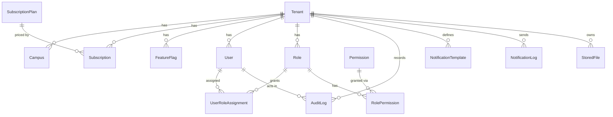
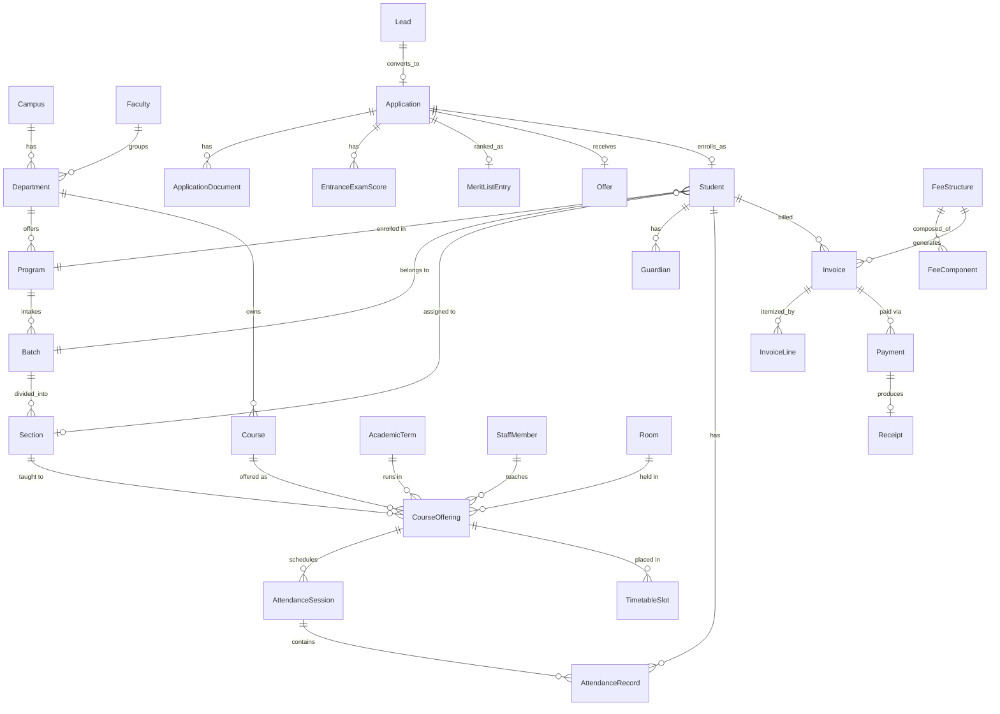

# Phase 3 — Database Design

**Builds on:** [Phase 2 Architecture](./phase-2-architecture.md) §5 (multi-tenancy), §2 (bounded contexts).
**Schema artifact:** [`prisma/schema.prisma`](../prisma/schema.prisma) — validated (`prisma validate`), formatted (`prisma format`), scoped to Wave 0 + Wave 1 per [PRD §6](./phase-1-prd.md#6-functional-scope-by-module-wave-01-detail-wave-24-summarized).

---

## 1. ER Diagrams

Split in two, matching the bounded contexts — a single 30-entity diagram is not legible and this document should be read, not just admired.

### 1.1 Wave 0 — Platform



### 1.2 Wave 1 — Core Academic Backbone



## 2. Indexing & Constraints Strategy

- **Every tenant-owned table** has a `tenant_id` column and a `@@index([tenantId])` (or a composite index leading with `tenant_id`) — this is the index that makes RLS-filtered queries fast, not just correct. Without it, the RLS policy still guarantees isolation but degrades to a sequential scan under the filter.
- **Composite uniques carry `tenant_id` as the leading column** (e.g., `@@unique([tenantId, admissionNumber])` on `Student`) rather than a bare unique on `admissionNumber` — admission numbers are only unique *within* a tenant, and a global unique constraint would be both wrong and a cross-tenant information leak (uniqueness violations reveal existence of another tenant's row).
- **Foreign keys use `onDelete: Cascade`** only where child rows have no independent meaning once the parent is gone (e.g., `ApplicationDocument` without its `Application`). Reference data (`Program`, `Course`) is not cascade-deleted from `Student`/`CourseOffering` — those relations stay restrictive by default, forcing an explicit archival decision (§4) instead of an accidental cascade wipe.
- **The room/timetable clash guarantee** from PRD §6.2 is enforced at the database level, not just application validation: `TimetableSlot` has `@@unique([tenantId, roomId, dayOfWeek, startTime])`. Application-level conflict detection gives a good error message; the DB constraint is what actually prevents the double-booking under concurrent writes.
- **Money fields are `Decimal(12,2)`**, never `Float` — fee amounts and payments must not be subject to floating-point rounding.

## 3. Multi-Tenant Enforcement: Row-Level Security

Per [Architecture §5](./phase-2-architecture.md#5-multi-tenancy-implementation), Prisma defines the schema but does not manage RLS — that's applied as raw SQL in the same migration that creates each tenant-owned table. Pattern, using `students` as the representative example:

```sql
-- migrations/<timestamp>_add_rls_students/migration.sql
ALTER TABLE students ENABLE ROW LEVEL SECURITY;
ALTER TABLE students FORCE ROW LEVEL SECURITY; -- applies even to the table owner

-- tenant_id is Prisma String -> Postgres text (no @db.Uuid in the schema), so the
-- comparison is text = text, not uuid = uuid.
CREATE POLICY tenant_isolation ON students
  USING (tenant_id = current_setting('app.tenant_id', true))
  WITH CHECK (tenant_id = current_setting('app.tenant_id', true));
```

Implemented and verified against a real local Postgres instance in [`prisma/migrations/20260806123000_enable_row_level_security/migration.sql`](../prisma/migrations/20260806123000_enable_row_level_security/migration.sql), which applies this generically to every table with a `tenant_id` column via an `information_schema` loop, and provisions the two roles from the paragraph below. Confirmed: a session scoped to Tenant A sees only Tenant A's rows, sees zero rows with no tenant context set (fails closed), and a cross-tenant `INSERT` is rejected by the `WITH CHECK` clause.

The application sets the session variable once per request, before any query runs, inside a Prisma `$transaction` or middleware:

```sql
SET LOCAL app.tenant_id = '<resolved-tenant-uuid>';
```

`SET LOCAL` (not `SET`) scopes the setting to the current transaction, so pooled connections never leak one request's tenant context into the next request that reuses the connection — this is the detail that makes RLS safe under PgBouncer/connection pooling rather than a subtle cross-tenant leak waiting to happen under load.

**CI enforcement:** every migration that adds a table with a `tenant_id` column must add its RLS policy in the same migration, or CI fails the merge (Phase 12 wires this as a migration-lint step, per Architecture §5's "non-negotiable"). Tables without `tenant_id` (the `SubscriptionPlan` catalog, `Permission` catalog) are explicitly exempt and allow-listed.

**Super Admin bypass:** platform (software-company) staff query through a separate DB role that has `BYPASSRLS`, used only by the Super Admin module's data-access layer — never by tenant-facing request handlers. This keeps "an engineer can see all tenants" an explicit, audited, narrow capability rather than an accidental side effect of a missing `WHERE` clause.

## 4. Partitioning Strategy

Not applied at Wave 1 launch (premature at low volume — see Architecture §11), but designed for now on the tables that will need it first:

| Table | Partition key | Trigger to apply |
|---|---|---|
| `attendance_records` | Range on `session.sessionDate`, monthly | Once a tenant crosses ~1M attendance rows/year (a 5,000-student tenant marking daily attendance across ~30 course offerings hits this within a year or two) |
| `audit_logs` | Range on `createdAt`, monthly | Applied earlier than attendance — audit logs accumulate from Wave 0 across every module and are write-heavy, read-rarely (mostly compliance lookups) |
| `notification_logs` | Range on `createdAt`, monthly | Same profile as audit logs |
| `payments` | Range on `createdAt`, yearly | Lower volume than attendance; yearly partitions keep reconciliation queries (which are typically "this financial year") fast without excessive partition count |

Postgres native declarative partitioning (`PARTITION BY RANGE`) is the mechanism — applied via a raw-SQL migration that converts the table in place, with new partitions created by a scheduled job (or `pg_partman` once partition-count management becomes tedious). This is a Phase 6+ operational task, flagged here so the schema's primary keys are already partition-compatible (no partitioned table can have a unique constraint that doesn't include the partition key — worth knowing now, before `attendance_records`' `@@unique([sessionId, studentId])` needs to become `@@unique([sessionId, studentId, sessionDate])` at partitioning time).

## 5. Archiving Strategy

- **Student lifecycle:** a `Student.status` of `GRADUATED` or `DROPPED_OUT` does not trigger deletion — academic records are retained per institutional/regulatory requirement (transcripts must be issuable years later). Instead, graduated cohorts move to a `is_archived` read path: dashboards and hot queries filter `status = ACTIVE` by default (already indexed, §2), keeping working-set queries fast without deleting anything.
- **Term closure:** once `AcademicTerm.status = CLOSED`, that term's `AttendanceSession`/`AttendanceRecord` rows become effectively immutable (enforced at the application layer — no use case exists to edit attendance in a closed term) and are candidates for cold storage after a retention window (institution-configurable, default 7 years for India regulatory alignment).
- **Hard deletion** is reserved for tenant offboarding (PRD §6.1) and is a distinct, explicit, audited workflow — not a byproduct of normal record lifecycle.

## 6. Backup Strategy

- **Continuous:** WAL (write-ahead log) archiving for point-in-time recovery, target RPO ≤ 5 minutes.
- **Snapshot:** daily full snapshot of each cluster (pool cluster and every silo cluster independently), retained 35 days, plus monthly snapshots retained 12 months for compliance/audit lookback.
- **Cross-region copy:** snapshots replicated to a second region — protects against a regional outage, not just disk failure.
- **Restore drills:** a scheduled (quarterly, Phase 13 owns the automation) restore-to-scratch-environment test — a backup strategy that has never been restore-tested is unverified, not a real backup strategy.

## 7. Replication Strategy

- **Pool cluster:** one primary + at least one synchronous standby (for failover) + one asynchronous read replica dedicated to dashboard/analytics read models (Architecture §10's CQRS-lite pattern reads from here, not the primary — keeps heavy Chairman-dashboard aggregation off the transactional write path).
- **Silo clusters:** same topology, sized independently per tenant's plan tier.
- **Failover:** automated primary promotion (managed Postgres service — RDS/Cloud SQL-equivalent, decided in Phase 11) with connection routing that respects the tenant-to-cluster map from Architecture §5.

## 8. Migration Strategy

- **Tooling:** Prisma Migrate for schema changes; raw SQL migrations (checked into the same `prisma/migrations/` history) for RLS policies, partitioning, and anything Prisma can't express declaratively.
- **Every migration is additive-first in production:** new column nullable or defaulted → backfill → application cutover → drop old column in a *later* migration. No migration both adds a NOT NULL column and expects existing rows to already satisfy it.
- **Per-module ownership:** because the bounded contexts (Architecture §2) are real, migrations are reviewed by whoever owns that module's domain layer — a migration touching `fee_structures` should not silently also touch `students`.
- **Multi-tenant safety gate (CI):** the lint check from §3 — no table with `tenant_id` ships without its RLS policy in the same migration — runs on every PR before merge, not as a manual checklist item.

---

**Next:** Phase 4 — System Design: API contracts (REST + GraphQL) and sequence flows for the Wave 1 use cases this schema now supports (lead → admission → enrollment → attendance → fee invoice → payment).
