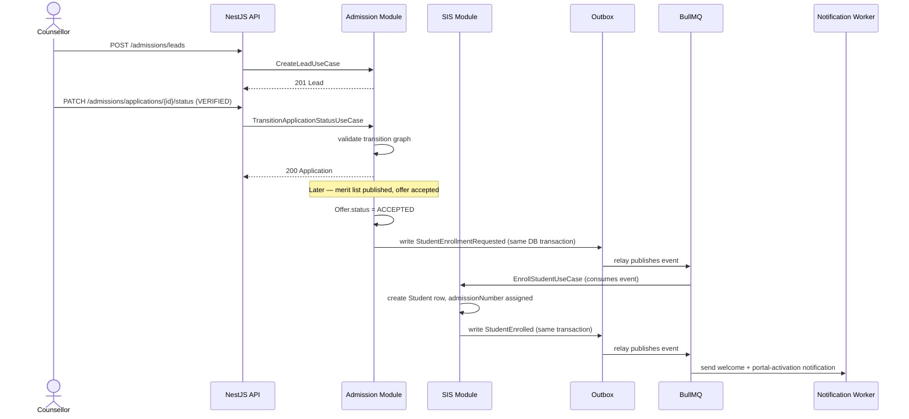
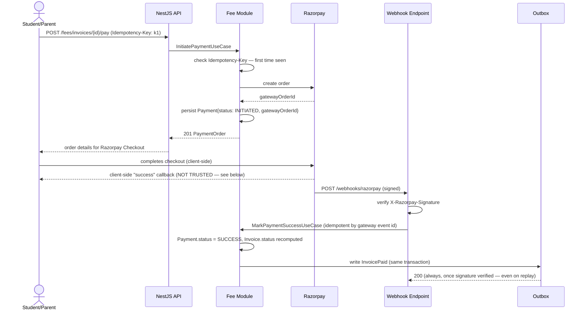
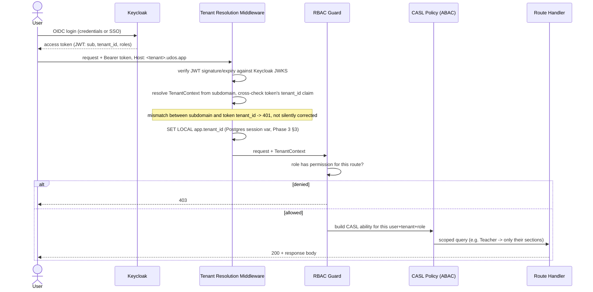

# Phase 4 — System Design

**Builds on:** [Phase 3 Database Design](./phase-3-database-design.md), [Architecture §4](./phase-2-architecture.md#4-communication-patterns).
**Artifacts:** [`api/openapi.yaml`](../api/openapi.yaml) (REST, lint-clean via `redocly lint`), [`api/schema.graphql`](../api/schema.graphql) (dashboard reads, parses via `graphql` SDL validation).

---

## 1. Why REST *and* GraphQL, not one or the other

CRUD/command operations (create a lead, transition an application, mark attendance, pay an invoice) map cleanly to REST resources and verbs, get standard HTTP caching/idempotency semantics for free, and are what most integrators (a mobile app, a third-party accreditation tool) expect. Dashboard reads are the opposite shape: one screen needs data from five bounded contexts at once (Chairman dashboard = admissions + revenue + attendance + department performance), and building that as five REST calls either means five round trips or a bespoke aggregation REST endpoint per dashboard. GraphQL's field-selection model fits that read shape directly, and because every dashboard field resolves against the CQRS-lite read models (Architecture §10), the resolvers stay cheap regardless of query shape — this isn't GraphQL-over-live-joins, which would reintroduce the N+1 problem it's meant to solve.

**Rule of thumb applied consistently:** if it mutates state, it's REST. If it's a read composed from multiple contexts for a screen, it's GraphQL. A single-resource read (`GET /students/{id}`) stays REST too — GraphQL isn't used just because it's available.

## 2. Sequence: Admission → Enrollment

**Why the outbox hop instead of SIS calling the Admission module directly, or vice versa:** enrollment is the seam between two bounded contexts that should not share a transaction — Admission's job ends at "offer accepted," SIS's job starts at "create the student record." Coupling them synchronously means an SIS outage blocks admissions from accepting offers, which is a worse failure mode than enrollment being eventually consistent by a few seconds.

## 3. Sequence: Fee Invoice → Razorpay Payment (the one flow that must not be gameable)

**Why the client-side success callback is never trusted to mark an invoice paid:** it's fully attacker-controlled — a modified request or a network replay could fire it without a real payment. Only the signed webhook (or, as a fallback, a server-to-server verification call to Razorpay's order-status API) is authoritative. This is the single most security-sensitive flow in Wave 1 and it's designed so "the browser says success" and "the invoice is paid" are two different, independently-verified facts.

**Why Idempotency-Key on `/pay`:** a flaky network causes the client to retry the POST; without the key, a retry creates a second Razorpay order for the same invoice, and a student could end up double-charged if both orders are separately completed. The key makes the retry return the original order instead.

**Why the webhook handler is idempotent by gateway event id, separately from the Idempotency-Key:** Razorpay itself retries webhook delivery until it gets a 200 — the handler must tolerate the same event arriving twice without double-crediting the invoice.

## 4. Sequence: Authentication & Authorization (every request, not just login)

**Why the subdomain and the token's `tenant_id` claim are cross-checked, not just one or the other trusted:** a user with a valid token for Tenant A hitting Tenant B's subdomain (typo, stale bookmark, or deliberate probing) must fail closed. Trusting the subdomain alone would let a valid-but-wrong-tenant token through if the middleware's tenant resolution had a bug; trusting the token alone would ignore the routing/RLS session variable entirely. Both must agree.

## 5. API Conventions (as implemented in `openapi.yaml`)

- **Versioning:** URI-versioned (`/api/v1/...`). Additive changes (new optional field, new endpoint) ship without a version bump; breaking changes get `/v2` with both versions live during a deprecation window — never an in-place breaking change to `/v1`.
- **Pagination:** cursor-based (`cursor`/`limit`, opaque cursor in `meta.nextCursor`) on every list endpoint. Offset pagination is not used anywhere — it's O(n) under the hood on large tables (`attendance_records`, `audit_logs`) and is exactly the tables Phase 3 §4 flags for partitioning, where offset pagination degrades worst.
- **Errors:** RFC 7807 `problem+json` shape (`type`, `title`, `status`, `detail`, `traceId`, field-level `errors[]`). The `traceId` ties a support ticket directly to the OpenTelemetry trace (Architecture §7) — "it errored" becomes a traceable request, not a guess.
- **404 vs. cross-tenant lookups:** a request for a resource that exists in a *different* tenant returns the identical 404 as a resource that doesn't exist at all. Returning a distinguishable "exists but not yours" response would leak cross-tenant existence information — a minor-seeming leak that's exactly the kind of thing a multi-tenant SaaS platform cannot afford (Architecture §6 threat model).
- **Idempotency:** required (`Idempotency-Key` header) on every money-movement endpoint; not required on pure reads or on writes that are naturally idempotent (`PUT .../records` replaces the full set, so a retry is already safe).
- **ABAC scoping is invisible at the contract level:** `GET /students` has no `campusId`/`departmentId` filter parameter for scoping — the caller's role/context determines what subset they see, applied server-side (§4 above). A parameter would imply the caller could ask for a broader scope and be denied; the correct contract is that the broader scope never appears in the response at all.

## 6. Rate Limiting & Abuse Controls

- Per-tenant, per-user token-bucket limits enforced at the API Gateway (Redis-backed counters, Architecture §6), tuned by endpoint sensitivity: authentication endpoints and `/webhooks/razorpay` (signature-verified separately) have the tightest limits; read-heavy dashboard GraphQL queries have higher allowances but are still capped to prevent a single tenant's dashboard polling from degrading others in the pool cluster.
- The webhook endpoint additionally rejects any request that fails signature verification *before* touching rate-limit or business logic — an unsigned flood doesn't get to consume application resources.

---

**Next:** Phase 5 — Folder Structure: the monorepo layout that houses the modular monolith (Architecture §1–3), the Prisma schema (Phase 3), and these API contracts (Phase 4) as the actual source of truth NestJS/Next.js build against.
